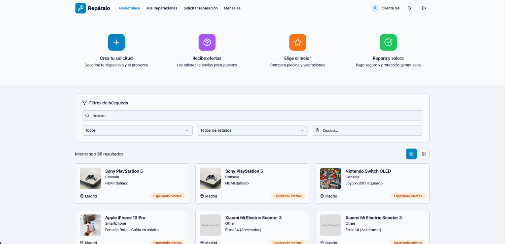
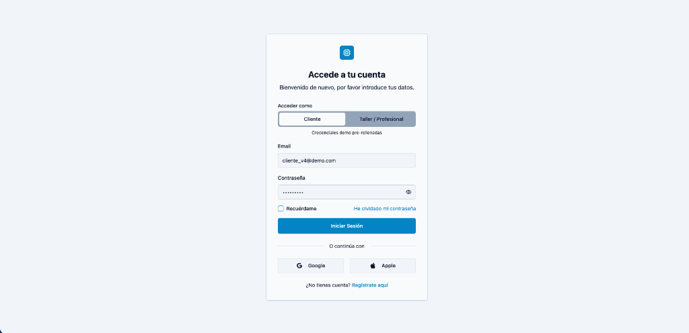
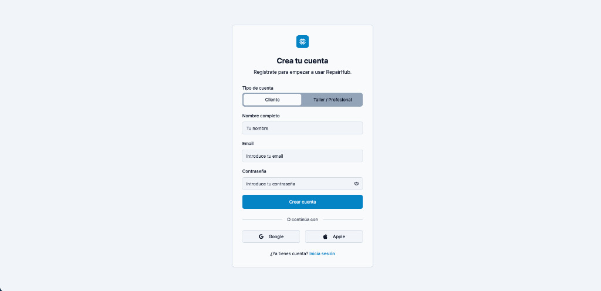
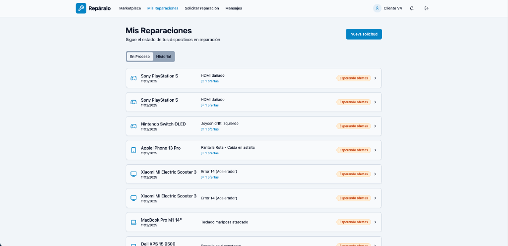
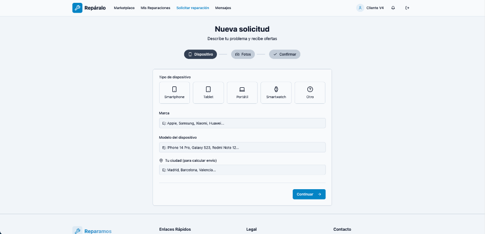
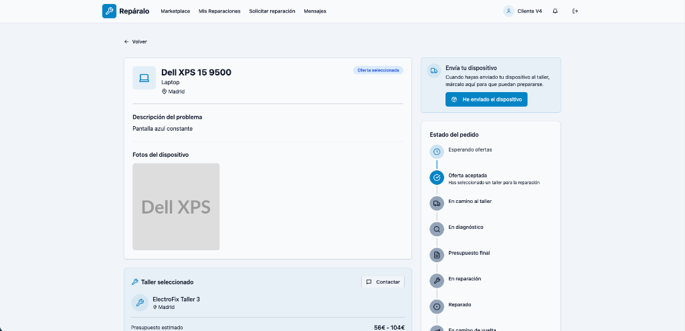
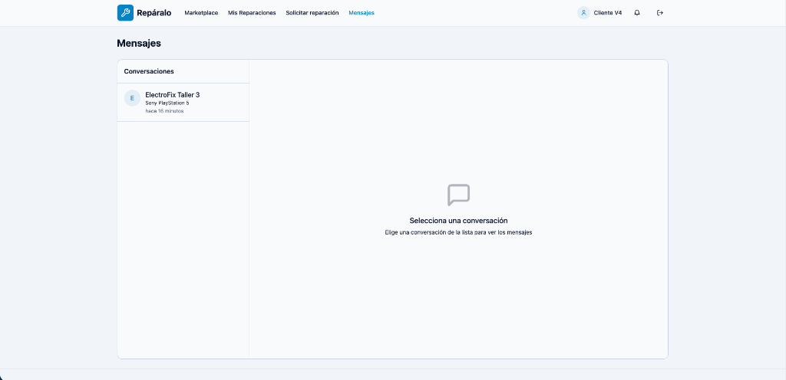
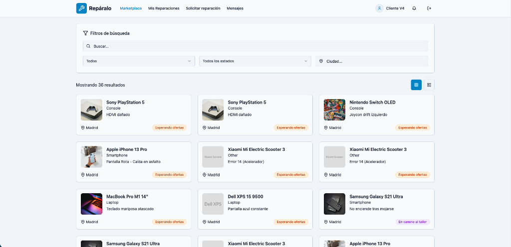
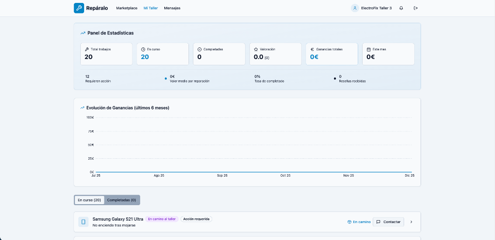

# Repáralo

Plataforma de gestión de reparaciones de dispositivos móviles.

> Este proyecto ha sido desarrollado utilizando **Lovable, supabase** y **Antigravity**.

## What technologies are used for this project?

This project is built with:

- Vite
- TypeScript
- React
- shadcn-ui
- Tailwind CSS

## 📱 Galería de Pantallas

<b>👀 Vista Previa de la Aplicación</b>

 

| **Landing Page** | **Login** |
|:---:|:---:|
|  |  |
| *Página principal con héroe y servicios* | *Acceso de usuarios* |

| **Registro** | **Mis Reparaciones (Cliente)** |
|:---:|:---:|
|  |  |
| *Creación de nueva cuenta* | *Panel del cliente con listado de reparaciones* |

| **Nueva Solicitud** | **Detalle de Solicitud** |
|:---:|:---:|
|  |  |
| *Formulario para solicitar nueva reparación* | *Vista detallada con estado y ofertas* |

| **Centro de Mensajes** | **Mercado de Solicitudes** |
|:---:|:---:|
|  |  |
| *Chat entre cliente y taller* | *Listado de reparaciones disponibles* |

| **Panel de Taller** | **(Próximamente)** |
|:---:|:---:|
|  | 🚧 |
| *Gestión de trabajos y ganancias del taller* | *Más funcionalidades...* |

